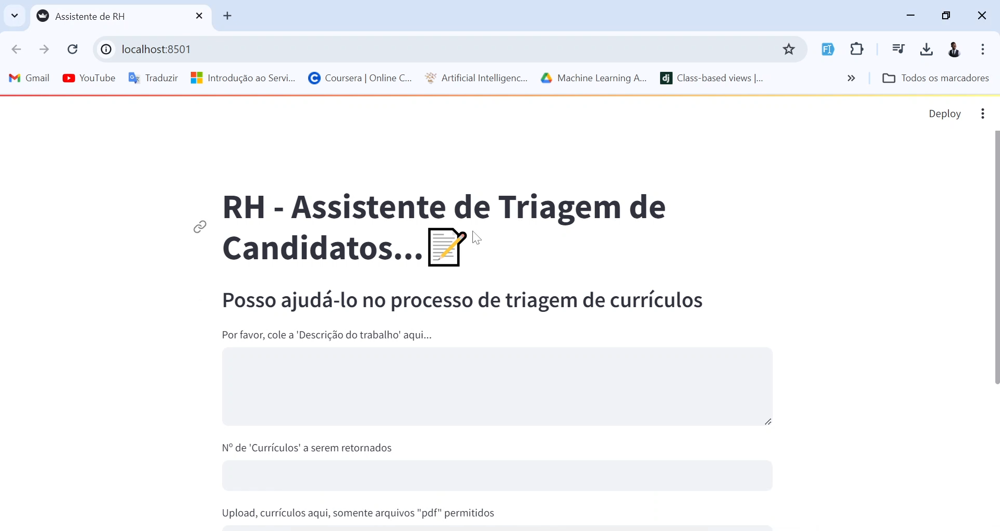
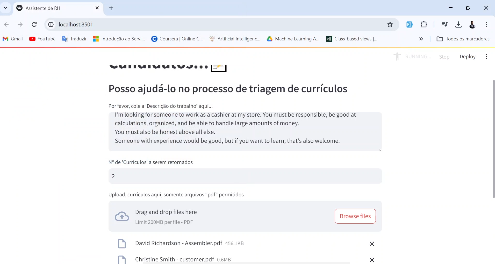
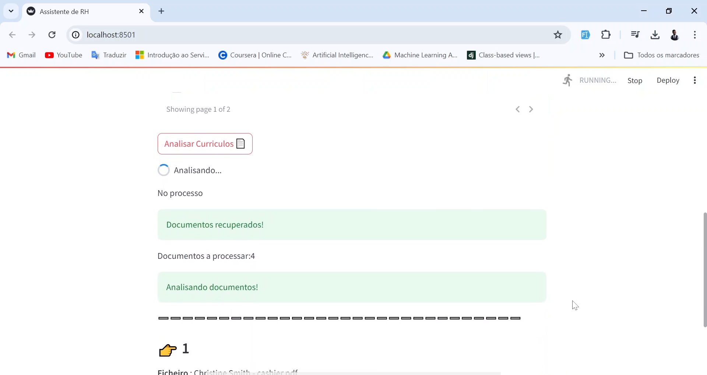
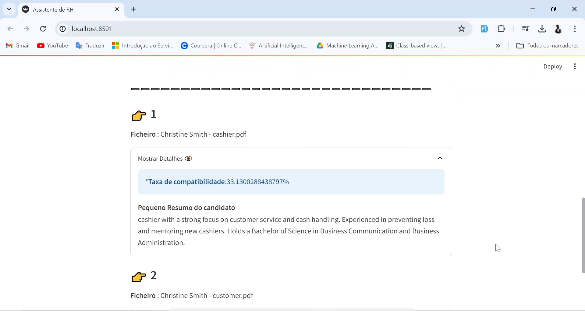

[MAINTENANCE_BADGE]: https://img.shields.io/badge/Maintained%3F-yes-green.svg
[PYTHON_BADGE]: https://img.shields.io/badge/python-3670A0?style=for-the-badge&logo=python&logoColor=ffdd54
[LICENSE_BADGE]: https://img.shields.io/pypi/l/ansicolortags.svg


<h1 align="center">Human Resources Assistant AI</h1>

![PYTHON][PYTHON_BADGE]
![LICENSE][LICENSE_BADGE]


<p align="center">
 <a href="#about">About</a> • 
 <a href="#gettingStarted">Getting Started</a> • 
 <a href="#howToRun">How To Run</a> • 
 <a href="#results">Results</a> • 
 <a href="#projectVideo">Project Video</a> • 
 <a href="#collaborators">Collaborators</a> •
</p>

<p align="center">
    
</p>

<h2 id="about">📌 About</h2>

This project is a Human Resources Assistant powered by AI that helps in the screening of CVs. The user can input a job description and specify the number of CVs they want to be returned. The system processes the CVs data, converts the CVs text into Langchain Documents, creates embeddings and a vectorstore, and then screens the most relevant documents with a score indicating the percentage match between the provided job description and the CV data.


<h2 id="gettingStarted">🚀 Getting Started</h2>

This section describes how to run the project locally.

<h3>Prerequisites</h3>

Ensure you have the following prerequisites installed:

- [Python 3.x](https://www.python.org/downloads/)
- [Streamlit](https://docs.streamlit.io/)
- [Langchain](https://python.langchain.com/v0.2/docs/introduction/)
- OpenAI API Key

<h2 id="howToRun">How to Run</h2>

- Clone the project repository from GitHub:

```bash
git clone https://github.com/EriveltoSilva/human-resources-assistant-ai.git
```


- Navigate to the project directory and install the required dependencies. 
```bash
pip install -r requirements.txt
```

- Then start the Streamlit app:

```bash
streamlit run main.py
```

<h2 id="results">🤝 Results</h2>

<p align="center">
    
</p>

<p align="center">
    
</p>

<p align="center">
    
</p>

<p align="center">
    
</p>

<h2 id="projectVideo">▶ Project Video</h2>

<a href="https://www.linkedin.com/posts/erivelto-da-costa-e-silva_recursoshumanos-triagemdecurraedculos-automaaexaeto-activity-7199593163492114432-PmJF?utm_source=share&utm_medium=member_desktop">
See a short video of how project works on my LinkedIn
</a>

<h2 id="collaborators">🤝 Collaborators</h2>

Special thanks to the project contributor:

<table>
  <tr>
    <td align="center">
      <a href="#">
        <br>
        <sub>
          <b>Erivelto Silva</b>
        </sub>
      </a>
    </td>
  </tr>
</table>

<h2 id="contribute">📫 Contribute</h2>

To contribute to this project, follow these steps:

1. `git clone https://github.com/EriveltoSilva/human-resources-assistant-ai.git`
2. `git checkout -b feature/NAME`
3. Follow commit patterns
4. Open a Pull Request explaining the problem solved or feature made. If applicable, include screenshots of visual modifications and wait for the review!
